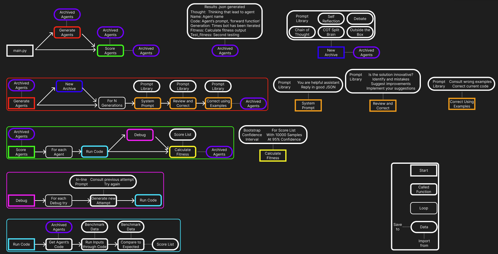

<h1 align="center">
 <i class="fab fa-google-plus"></i> </a><br>

<b>Automated Design of Agentic Systems</b><br>
</h1>

<p align="center">
  <a href="https://github.com/ShengranHu/ADAS/blob/main/LICENSE"></a>
  <a href="https://arxiv.org/abs/2408.08435"></a>
  <a href="https://www.shengranhu.com/ADAS/"></a>
  <a href="https://twitter.com/shengranhu/status/1825555341922480322"></a>
</p>

A fork of ShengranHu/ADAS:main for use with local LLMs through ollama


<p align="center">
</a><br>
</p>

## Setup
```bash
conda create -n adas python=3.11
conda activate adas
pip install --user -r requirements.txt
```
Make sure Ollama is running on the default port 

## Running Instructions

### Running Meta Agent Search

To run experiments for each domain, use the following command from the root of the repository. The code in each folder is self-contained. Launch experiments using the `search.py` script located in each domain's folder.

```bash
python {DOMAIN}/search.py
```

Replace `{DOMAIN}` with the specific domain folder name {`_arc`, `_drop`, `_mgsm`, ...} to run the experiment for.

If you want to retest existing solutions with a new model, i.e. llama 4 or similar comes out, you can just run the command with --mode evaluate and it will skip generating new agents, 

### Customizing Meta Agent Search for New Domains

You can easily adapt the code to search for new domains. To do so, follow these steps:

1. Modify the `evaluate_forward_fn()` function and adjust any necessary formatting prompts (e.g. [this line](https://github.com/ShengranHu/ADAS/blob/main/_mmlu/search.py#L89)) in the `search.py` file. 

2. Consider adding additional basic functions for the meta agent to utilize during the design process (similar to [this line](https://github.com/ShengranHu/ADAS/blob/main/_arc/search.py#L161)).

3. Update the domain-specific information within the prompts to match the requirements of your new domain (e.g. [this line](https://github.com/ShengranHu/ADAS/blob/main/_mmlu/mmlu_prompt.py#L229)).

4. Run the search and evaluation on your new domain.

### Safety Consideration
> [!WARNING]  
> The code in this repository involves executing untrusted model-generated code. We strongly advise users to be aware of this safety concern. While it is highly unlikely that model-generated code will perform overtly malicious actions in our current settings and with the models we use, such code may still act destructively due to limitations in model capability or alignment. By using this repository, you acknowledge and accept these risks.


## Citing
If you find this project useful, please consider citing:
```
@article{hu2024ADAS,
title={Automated Design of Agentic Systems},
author={Hu, Shengran and Lu, Cong and Clune, Jeff},
journal={arXiv preprint arXiv:2408.08435},
year={2024}
}
```